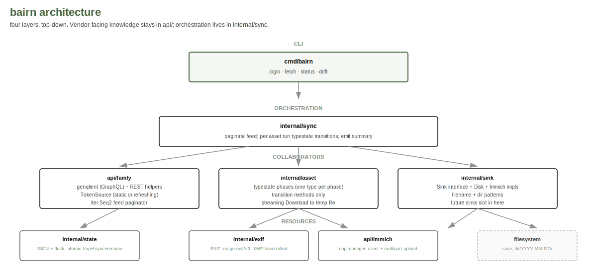

# bairn architecture

A small Go binary. Pull family-relevant photos and videos from a
Famly account, write them to a local directory with full EXIF
metadata reinjected, optionally also push to Immich.

## Layers



## Invariants

1. **Single transition path per asset.** Discovered → Downloaded
   → Saved → (Uploaded?) → Recorded. The compiler enforces this;
   each state is a distinct Go type, and the only public path
   between them is the transition method.
2. **Disk save is durability.** `Saved` is the first phase that
   survives a crash. EXIF reinjection is folded into Save (the file
   does not become visible at its final path until both have
   happened). A run interrupted between `Saved` and `Recorded`
   recovers on the next start because the state file shows
   `savedAt` set and `recordedAt` empty.
3. **Generated code is read-only.** Anything under `api/*/gen.go`
   or `api/immich/imapi/imapi.go` is produced by `make gen`. The
   `// Code generated ... DO NOT EDIT.` header is the contract.
4. **Vendor knowledge stays in `api/`, never in `internal/`.**
   Famly URLs, GraphQL ops, JSON shapes, Immich endpoints stay
   behind the `api/` boundary. `internal/sync` and friends work
   against typed interfaces.
5. **No live vendor calls in default `make test`.** Every test
   uses `httptest.Server` against fixtures. The `bairn drift`
   subcommand is the explicit exception.
6. **All asset metadata embeds in-file.** No sidecar JSON, XMP,
   or text files. EXIF/XMP/IPTC for JPEG/TIFF; filename + mtime
   for video. See ADR 0005.
7. **Privacy boundary at the repository edge.** Discovery captures,
   schema dumps, and vendor-specific manifests are gitignored. The
   committed surface stays minimal.

## Commands

| Subcommand | Purpose |
|---|---|
| `bairn fetch` | Pull recent feed pages, save assets to disk with EXIF reinjected, optionally upload to Immich. Cron-friendly. |
| `bairn status` | Print last-run summary from the JSON state file. |
| `bairn drift` | Run shape probes against the live vendor surface; diff against committed baselines; exit non-zero on drift. |

## Auth model

- **Famly**: `FAMLY_ACCESS_TOKEN` (preferred for cron) or
  `FAMLY_EMAIL` + `FAMLY_PASSWORD` (auto-refresh on 401).
- **Immich (optional)**: set both `IMMICH_BASE_URL` and
  `IMMICH_API_KEY` to enable the Immich sink. Absence of either
  disables Immich; bairn runs disk-only.
- All can also live in `$XDG_CONFIG_HOME/bairn/config.toml`. CLI
  flags override env, env overrides config file.

## Storage

- **Save dir**: `$XDG_DATA_HOME/bairn/assets/` by default;
  override via `--save-dir` or `BAIRN_SAVE_DIR`.
- **Filename pattern**: `{{.Source}}-%Y-%m-%d_%H-%M-%S-{{.ID}}.{{.Ext}}`
  by default (Source values like `feed-image` already carry the
  type prefix). Strftime tokens for time, Go template tokens for
  fields.
- **Directory pattern**: `%Y-%m-%d/` per-day buckets by default.
- **State file**: `$XDG_STATE_HOME/bairn/state.json` by default,
  with `flock` for single-writer enforcement. Override via
  `--state-path` or `BAIRN_STATE_PATH`. A common alternate is
  `<save-dir>/.bairn-state.json`.

## Build

```
make gen     regenerate api/famly/gen.go and api/immich/imapi/imapi.go
make test    go test -race ./...
make build   bin/bairn for the host
make build-linux bin/bairn-linux-amd64 for headless
```

## Modern Go

This binary targets Go 1.25+. Idioms in use:

- `tool` directive in go.mod for codegen (no tools.go)
- `log/slog` JSON handler for structured output
- `iter.Seq2` for the feed paginator
- `errors.Join` and `%w` for error chains
- `context.Context` end-to-end including iterators
- `slices`, `maps`, `cmp` stdlib packages
- `testing/synctest` for deterministic time tests
- `cenkalti/backoff/v5` for retry primitive
- `dsoprea/go-exif/v3` for EXIF rewrite
- `genqlient` for typed GraphQL against the captured schema
- `oapi-codegen` for typed Immich client
- Typestate via distinct Go types per asset lifecycle phase

## Where to read what

- `docs/decisions/` for ADRs (the load-bearing choices)
- `discovery/PROTOCOL.md` for the vendor-API methodology
- `internal/sync/sync.go` for the orchestration loop
- `internal/asset/states.go` for typestate definitions
- `internal/sink/sink.go` for the sink interface
- `cmd/bairn/main.go` for CLI entry
