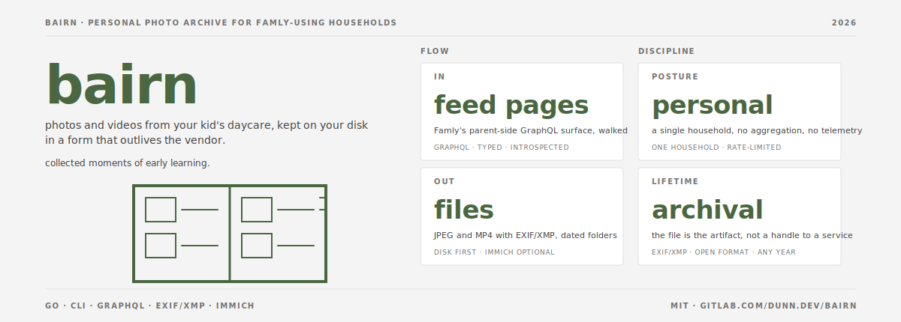
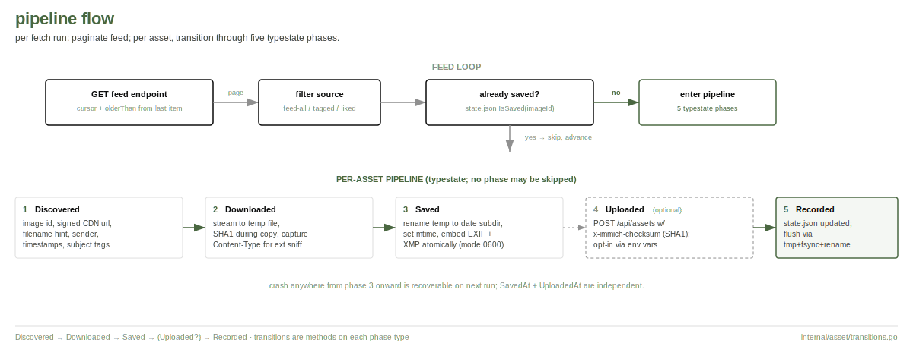

# bairn

[](LICENSE)


A personal archive tool for [Famly][famly]-using households. bairn
pulls your kid's photos and videos from Famly's nursery feed and
saves them to a directory on your own disk, with full metadata
(timestamps, post body, educator name, kid tags) embedded into each
file via [EXIF][exif] and [XMP][xmp]. Nothing about your child's
photo history depends on Famly continuing to exist as a company.

Bairn is an [archival][archival] tool, not a privacy gateway: every
piece of context the vendor exposes lands inside the file itself.
What happens to those files after you have them is your call.

[famly]: https://famly.co/
[exif]: https://en.wikipedia.org/wiki/Exif
[xmp]: https://en.wikipedia.org/wiki/Extensible_Metadata_Platform
[archival]: ./docs/decisions/0005-archival-posture.md

## Who this is for

You're a parent (or co-parent, grandparent, household admin) whose
kid's daycare or preschool uses Famly, and you:

- Want a [permanent local copy][permanent-local] of every photo and
  video the educators post, in date-organized folders that survive
  Famly outages, account closures, and corporate reshuffles.
- Want the metadata (post body, educator's name, the day the photo
  was taken) carried *inside* the file via standard EXIF/XMP, so any
  photo viewer or future archival workflow can read it.
- Are comfortable running a single Go binary from a terminal or
  cron, on a laptop or a small home server.

If your school doesn't use Famly, or if you're already happy with
how Famly's mobile app surfaces history, bairn is not for you.

[permanent-local]: https://en.wikipedia.org/wiki/3-2-1_backup_strategy

## What it does



bairn does five jobs:

1. **Authenticate.** You give bairn your Famly email and password
   once via `bairn login`; it exchanges them for a session token at
   the Famly GraphQL endpoint and verifies the token works for API
   calls. For unattended runs, set `FAMLY_EMAIL` and `FAMLY_PASSWORD`
   in your shell or cron environment so bairn re-authenticates when
   the session token rotates. A static `FAMLY_ACCESS_TOKEN` is also
   accepted for [MFA-protected accounts][mfa-fallback].

2. **Paginate the feed.** bairn walks Famly's
   `/api/feed/feed/feed` endpoint, page by page, stopping at
   `--max-pages` (default 3) or when Famly returns no more items.
   The default `--source=all` mode includes every image and video on
   each post; alternative `--source=tagged` and `--source=liked`
   filters are available for households whose schools tag photos per
   kid.

3. **Fetch the highest-resolution variant.** Famly's CDN serves
   sized variants under path segments like `/1024x768/`; bairn
   rewrites the segment to the image's reported original
   dimensions, so what lands on disk is the largest JPEG the server
   stored, not the medium thumbnail.

4. **Embed metadata in-file, then save atomically.** Each saved
   JPEG carries the post body, the post timestamp, the educator's
   name, and any per-image kid-tags as both [EXIF][exif] (legacy +
   ubiquitous) and [XMP][xmp] (modern, what Apple Photos and
   Lightroom prefer). No sidecar files; everything travels with the
   image. See [ADR 0005][adr-0005] for the archival contract.

5. **Track progress in a JSON state file.** A single
   `state.json` records what's been downloaded, saved, and
   (optionally) uploaded. Reruns skip work already done. The state
   file lives under [`$XDG_STATE_HOME`][xdg] by default and is held
   under an OS file lock so concurrent runs fail fast rather than
   corrupt state.

[mfa-fallback]: ./docs/decisions/0003-auth-token-and-refresh.md
[adr-0005]: ./docs/decisions/0005-archival-posture.md
[xdg]: https://specifications.freedesktop.org/basedir-spec/basedir-spec-latest.html

## End-to-end setup

What you'll need:

- A [Famly][famly] account (your normal parent login).
- A laptop or small server that can run a Go 1.25+ binary.
- Under ten minutes for first-time setup. Subsequent runs are
  `bairn fetch`.

```
# 1. Build the binary.
git clone https://gitlab.com/dunn.dev/bairn.git
cd bairn
make build                                     # produces bin/bairn
sudo install bin/bairn /usr/local/bin/         # optional

# 2. Verify your Famly credentials work.
bairn login                                    # interactive, no-echo
# login: ok (logged in as you@example.com, N children visible)

# 3. Make those credentials available to fetch runs.
export FAMLY_EMAIL=you@example.com
export FAMLY_PASSWORD=<your-password>

# 4. Pull a small first batch.
bairn fetch --max-pages 1
bairn status
ls $XDG_DATA_HOME/bairn/assets/                # date subfolder; full-res JPEGs
```

For unattended cron, put the env vars in a shell-init file (mode
0600) and source it from your crontab or systemd unit. Anonymous
inline, this is one line of crontab.

### Or run the container

Each tagged release ships a distroless OCI image at
`registry.gitlab.com/dunn.dev/bairn/cli` (`:latest` and `:vX.Y.Z`):

```
docker pull registry.gitlab.com/dunn.dev/bairn/cli:latest

docker run --rm \
  -e FAMLY_EMAIL -e FAMLY_PASSWORD \
  -v ~/Pictures/bairn:/data \
  registry.gitlab.com/dunn.dev/bairn/cli:latest \
  fetch --max-pages 1
```

The image's working directory is `/data`; saved photos and the JSON
state file land there. Mount a host directory so the archive
persists between runs. Optional Immich vars (`IMMICH_BASE_URL`,
`IMMICH_API_KEY`) wire the secondary sink as in the binary case.

## Configuration

Auth (one of these is required):

| Var | Purpose |
|---|---|
| `FAMLY_EMAIL` + `FAMLY_PASSWORD` | **Recommended.** bairn re-authenticates on token expiry. |
| `FAMLY_ACCESS_TOKEN` | Advanced; use when MFA is enabled on the account. |
| `FAMLY_DEVICE_ID` | Optional; default is a stable per-host UUID. |

Save and state:

| Var | Purpose | Default |
|---|---|---|
| `BAIRN_SAVE_DIR` | Root for saved photos and videos | `$XDG_DATA_HOME/bairn/assets` |
| `BAIRN_STATE_PATH` | JSON state file | `$XDG_STATE_HOME/bairn/state.json` |
| `BAIRN_LOG_FORMAT` | `json` (cron) or `text` (interactive) | `json` |

Optional Immich sink (uploads alongside disk save):

| Var | Purpose | Default |
|---|---|---|
| `IMMICH_BASE_URL` | Immich server URL, e.g. `https://photos.example.com` | unset |
| `IMMICH_API_KEY` | Immich API key (User Settings → API Keys) | unset |

**Immich version requirement: v2.7.5 or later.** bairn targets the
post-zod-migration `/assets` upload contract
([immich-app/immich#26597](https://github.com/immich-app/immich/pull/26597),
April 2026). Older Immich versions are not supported.

CLI flag overrides for `bairn fetch`:

```
--max-pages N            stop after N feed pages (default 3, 0 = unlimited)
--dry-run                enumerate without fetching or saving
--source MODE            feed filter: all (default; every image and video),
                         tagged (only images tagged with one of your children),
                         or liked (only images liked by a household login)
--save-dir DIR           override BAIRN_SAVE_DIR
--filename-pattern PAT   override the default filename template
--dir-pattern PAT        override the default directory template
--include-system-posts   include automated check-in/sign-out posts
                         (off by default; their templated text isn't great
                         photo caption material)
```

## Filename layout

Default: `{{.Source}}-%Y-%m-%d_%H-%M-%S-{{.ID}}.{{.Ext}}` under
`%Y-%m-%d/`. So a real saved file looks like
`2026-05-06/feed-image-2026-05-06_18-33-21-<uuid>.jpg`. Tokens:

- Strftime: `%Y %m %d %H %M %S %j` (UTC, from the asset's vendor-side
  timestamp).
- Go template: `{{.Source}} {{.ID}} {{.FeedItemID}} {{.Ext}}`.

Override `--filename-pattern` and `--dir-pattern` to match your own
layout convention.

## Embedded metadata, per file

bairn writes both EXIF and XMP, on the principle that some readers
prefer one and some prefer the other (see [ADR 0005][adr-0005]).
Concretely:

| Tag | Source | Notes |
|---|---|---|
| EXIF `DateTimeOriginal` | `image.createdAt.date` | Famly's timestamp for the image. |
| EXIF `OffsetTimeOriginal` | `image.createdAt.timezone` | Read from Famly; commonly UTC. |
| EXIF `ImageDescription` | post body, sanitized | Newlines collapsed; truncated at word boundary. |
| EXIF `Artist` / XMP `dc:creator` | educator name | Whoever posted. |
| EXIF `Software` | bairn version | Self-attribution. |
| EXIF `UserComment` | full body + sender | Unicode-safe; some viewers warn on dsoprea's "Unicode" prefix. |
| XMP `dc:description` | full body | Newlines preserved; XMP can carry them safely. |
| XMP `dc:subject` | per-image kid tag names | When Famly tags the photo per child. |
| XMP `photoshop:DateCreated` | image timestamp | ISO 8601 with offset. |

GPS coordinates are off by default. They embed only when the
operator supplies coordinates explicitly.

## Local dev and smoke testing

```
make gen           regenerate api/famly/gen.go and api/immich/imapi/imapi.go
make test          go test -race ./...
make smoke         run the longer-running fixture tests
make smoke-immich  live round-trip against the operator's Immich
make pre-tag-check test + smoke-immich (run before git tag)
make lint          golangci-lint run
make build         bin/bairn for the host
make build-linux   bin/bairn-linux-amd64 (headless server deploy)
make build-darwin  bin/bairn-darwin-arm64 (Apple Silicon laptop)
make build-all     both of the above
```

### Pre-tag gate

Before cutting a release tag, run:

```
make pre-tag-check
```

That runs the unit suite **and** a real-server round-trip against
your Immich: login, mint an ephemeral API key, upload a tiny JPEG
via the production sink, assert created, delete the asset, delete
the API key. The round-trip catches controller-layer wire-contract
enforcement that no static spec models. v0.4.3 shipped without
this gate and broke uploads against Immich v2.7.5; v0.4.6 added it.

`make smoke-immich` reads `IMMICH_BAIRN_HOST` /
`IMMICH_BAIRN_USER` / `IMMICH_BAIRN_PASSWORD` (recommended: a
quota-limited test user separate from your archive account), or
falls back to `IMMICH_BASE_URL` / `IMMICH_API_KEY` for ad-hoc
runs. The same gate is wired into CI as the `smoke-immich` job;
it's `allow_failure: true` by default so a forker without the
vars set sees yellow but isn't blocked.

For the no-write case (auditing a server you can't upload to),
`bairn smoke immich --probe-only` sends a deliberately incomplete
POST and parses the validator's rejection. `--capture <path>`
writes the captured required-field set as a static manifest.

`make gen` requires a populated `discovery/baselines/__schema.json`
for Famly. The schema dump is gitignored; each operator runs
discovery (`discovery/probe/introspect.py`) on their own credentials.
`api/famly/schema.graphql` is the hand-curated SDL bairn validates
operations against.

`make test` includes a metadata round-trip test that uses
`exiftool -j` to read back what bairn wrote and assert it matches
intent. The test is skipped automatically when `exiftool` isn't on
PATH, so a bare CI without it stays green; install with
`brew install exiftool` (mac) or
`apt install libimage-exiftool-perl` (debian).

## Discovery and drift

bairn talks to a vendor surface we don't control. The
[discovery toolkit](./discovery/PROTOCOL.md) is bairn's
methodology for noticing when Famly's response shapes change. Three
modes:

- **Shape probe**: hit a known endpoint list, record JSON-key
  signatures, diff against committed baselines.
- **Traffic capture**: drive Famly's web app via Playwright,
  capture HARs, find endpoints we don't yet know about.
- **Schema introspection**: when a vendor exposes GraphQL with
  introspection enabled, dump the schema for typed code gen.

Outputs (manifests, baselines, schema dumps, captured HARs) are
gitignored on purpose. The methodology is shared; the vendor-specific
artefacts are operator-only.

## Privacy posture

Discovery captures, HAR files, schema dumps, the per-operator
endpoint manifest, and the generated state file are gitignored.
The committed source tree carries the methodology; vendor-specific
outputs stay on the operator's machine.

The [discovery toolkit](./discovery/) is generic. Operators provide
their own manifest (copy from `discovery/probe/manifest.example.toml`
to `discovery/probe/manifest.toml`) and run probes against their own
credentials.

Files saved by bairn default to mode `0600` because the photos and
their embedded metadata describe minors. The operator can loosen
explicitly. Bairn embeds every piece of context Famly exposes into
the file's metadata; what travels with the file when the operator
moves it is the operator's call.

## Status

bairn is at v0.1.0. The disk-first save path is validated against
the maintainer's Famly account, with full EXIF and XMP embedded and
reruns idempotent. Broader validation across other Famly accounts
is pending. The Immich upload path is fixture-tested, not yet
live-tested.

## Architecture

The non-obvious design decisions are written up under
[`docs/decisions/`](./docs/decisions/). If you read one
supplementary file beyond this README, make it
[ARCHITECTURE.md](./ARCHITECTURE.md).

The seven ADRs as of v0.1.0:

- [0001](./docs/decisions/0001-spec-first-clients.md) spec-first typed clients via codegen
- [0002](./docs/decisions/0002-typestate-asset-lifecycle.md) typestate for the asset lifecycle
- [0003](./docs/decisions/0003-auth-token-and-refresh.md) Famly auth: token-first with optional refresh
- [0004](./docs/decisions/0004-state-as-json-file.md) state as a JSON file with file lock
- [0005](./docs/decisions/0005-archival-posture.md) archival posture, no sidecars
- [0006](./docs/decisions/0006-sink-abstraction.md) sink abstraction (disk + Immich + future)
- [0007](./docs/decisions/0007-llm-augmented-ci.md) LLM-augmented CI (deferred)

## Prior art

- [`jacobbunk/famly-fetch`][jacobbunk] (Python). Built an integration
  against Famly's API first; bairn's REST surface follows that map.
  Different design (streamed downloads, JSON state, optional Immich
  layer, in-file metadata only, no sidecars) and different language
  but same conceptual lineage. Established prior art; see
  [`NOTICE.md`](./NOTICE.md) for context.

[jacobbunk]: https://github.com/jacobbunk/famly-fetch

## On the integration path

bairn implements Famly's parent-side API surface using the operator's
own credentials, against the same endpoints the official mobile and
web apps use. It is the single-household, personal-archive expression
of that path: one operator, one account, one host, human-rate access
(requests paced at the rate a single human user would naturally
generate; see condition 4 in `NOTICE.md`). See [`NOTICE.md`](./NOTICE.md)
for the integration-path detail and the full conditions under which
using bairn is reasonable.

A parent-side data-export feature has been on Famly's product
backlog since 2024 without delivery. Until that feature ships,
bairn provides a local archive so that a kid's photo history isn't
indefinitely contingent on Famly continuing to host it.

If your organization needs richer integration than bairn (multi-
account, push notifications, write access, write-back to Famly),
the official API access add-on is the right answer. bairn is
explicitly *not* that.

## License

[MIT](./LICENSE).

bairn is not affiliated with Famly. Use only with credentials for an
account you own. Respect rate limits like a single human user would.
This is a personal-archive tool: single household, single account,
single host. See [`NOTICE.md`](./NOTICE.md) for full context.
