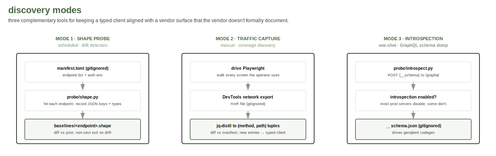

# Vendor API integration protocol

A reusable methodology for building a typed client against a vendor
JSON-over-HTTP API where the official documentation is incomplete
or absent. Some vendors actively direct integrators to inspect their
web client's network traffic and construct equivalent queries; this
protocol formalizes that pattern.

This is the methodology bairn uses against its own vendor. The
scripts in `probe/` are deliberately generic and operate against
whatever endpoint manifest the operator supplies. Vendor-specific
manifests, captured baselines, session walks, and schema dumps are
gitignored; only the methodology and the generic tooling live in
version control.

## Goals

1. **Coverage**: know the set of endpoints the official client uses
   that the integrator's tool also needs.
2. **Drift detection**: notice when the vendor changes a response
   shape before users do.
3. **Privacy**: never publish content that would surface the vendor's
   internal model unnecessarily, including endpoint manifests, raw
   responses, or schema dumps. The methodology is shared; the
   vendor-specific outputs are not.

## Principles

- **Scripts are generic; outputs are operator-only.** Anything in
  `probe/` should work against any vendor. Anything that names the
  vendor's endpoints, types, or fields stays out of the tree
  (`baselines/`, `sessions/`, `captures/` are gitignored).
- **Shape, not content.** Drift baselines store JSON keys and types,
  never values. A diff tells you the surface changed without
  revealing what data was returned.
- **Single human-rate.** Discovery walks pace requests at the rate a
  user would. Vendor APIs are not load tests; rate-limit-friendly
  behaviour also reduces the chance of trips alarming detection.
- **One account, your own.** Discovery is run with credentials for
  an account the operator owns. No multi-tenant access, no
  shared-credential reuse.
- **Re-runnable.** Probes produce deterministic artifacts so a
  follow-up walk can detect drift without remembering the prior
  state.

## Three modes

### Mode 1: shape probe

The cheapest and most repeatable mode. Given a manifest of known
endpoints, hit each one and record a JSON-key signature. Diff
against a prior baseline to detect schema drift.

Use when:
- You already know the surface your tool depends on.
- You want a CI-friendly check that the vendor hasn't changed
  shapes underneath you.
- You need a regression artifact for tests.

Tool: `probe/shape.py`. Manifest format documented in the script
header. Output: `<endpoint-id>.shape` files containing recursive
type signatures only.

A shape signature for a `/me`-style endpoint looks like:

    {
      "email": "str",
      "loginId": "str",
      "name": {"firstName": "str", "lastName": "str"},
      "roles": [{"id": "str", "permissions": ["str", "<n=12>"]}, "<n=3>"]
    }

That's the full information we ever record. No values, no IDs, no
PII.

### Mode 2: traffic capture

The discovery mode for finding endpoints you don't yet know about.
This mirrors the path many vendors' own support teams direct
integrators to: open the browser's developer tools, inspect the
network tab while using the application, and observe the queries
the official client sends. Drive the official client through every
screen a user can reach; capture network traffic; diff observed
paths against your manifest; new entries are candidates for the
typed client.

Use when:
- Prior art (e.g. an existing open-source port) is incomplete.
- The vendor has shipped a new feature you can see in the UI but
  haven't yet mapped.
- You want to verify your manifest covers everything the official
  client touches.

Tool: `probe/capture.md` (a playbook, not a script). Outputs are
HAR files captured from the browser, gitignored.

Distill HAR to unique (method, host, pathname) tuples with a small
jq filter; sort; diff against the manifest. New tuples are leads.

### Mode 3: schema introspection

The shortcut that obviates much of mode 2 when available. If the
vendor exposes GraphQL with introspection enabled, you can dump the
full schema in one POST. From there, generate types and clients
mechanically.

Use when:
- The vendor's API is GraphQL.
- A single introspection probe returns a populated `__schema`.

Tool: `probe/introspect.py`. Output: full schema as JSON, gitignored
(it's vendor-internal information).

Most production GraphQL servers disable introspection; a single
probe takes 30 seconds to confirm either way. When it works, it
collapses the manifest-maintenance work into a codegen pipeline.

## Workflow

The three modes feed each other:

1. Run mode 3. If introspection is enabled, generate a typed client
   from the schema; manifest-maintenance moves to operation files
   that select fields, not endpoints.
2. Run mode 2 on the screens you care about. Diff observed paths
   against the manifest (or against the GraphQL operations from
   step 1). Add anything new.
3. Run mode 1 on a schedule. Catches drift between releases.

For tools that only need a stable subset, mode 1 alone is enough.
For tools that aim to track an evolving vendor surface, all three
together are the long-term posture.

## Privacy operations

Treat captured artifacts the way you'd treat credentials:

- Captured HARs contain auth headers, cookies, full responses, and
  whatever PII the responses carry. Never commit. Delete once the
  walk is done.
- Schema dumps reveal the vendor's internal domain model. They
  belong in the gitignored baselines, not the public artifact.
- Shape baselines (mode 1 outputs) are the safe-to-share-internally
  artifact. Even those should be gitignored unless the operator has
  decided the vendor's response shape is publishable (it usually
  isn't).

The committed surface is the methodology, the generic scripts, and
your own client implementation. Everything else is operator-side.

## Why this matters

A typed client built against a vendor's actual API surface tends to
settle into one of two stable states:

- A maintained client that follows the vendor's drift, occasionally
  breaks, gets patched. Healthy.
- A snapshot that worked once, drifted silently, and lost users
  before the maintainer noticed. Unhealthy.

Mode 1 is the active boundary between those states. It's a 10-line
config and a cron entry. The yield is a maintainer who learns about
drift before users do.
