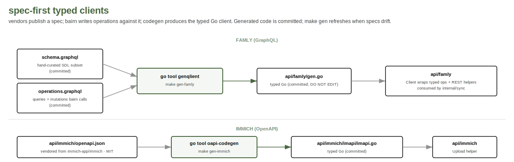

# ADR 0001: spec-first typed clients via codegen

**Status**: accepted, 2026-05-07

## Context

bairn talks to two external surfaces. Famly exposes a GraphQL
endpoint with introspection enabled (3,916 types as of capture).
Immich publishes an OpenAPI 3.x spec. Both can drive code
generation; neither requires us to hand-write client structs.

A prior-art Python port of Famly's API surface (jacobbunk/famly-fetch)
hand-rolls its types from observed responses. That works but
silently rots when the vendor changes shapes. We don't want to
inherit the rot.

## Decision

The Famly and Immich clients are generated from their respective
specs, not hand-written.

- Famly: `genqlient` against the introspected schema. Operations
  live in `api/famly/operations.graphql`. Generated client lives
  in `api/famly/gen.go` and is committed.
- Immich: `oapi-codegen` against a vendored copy of Immich's
  OpenAPI spec, filtered to the asset and album endpoints. Generated
  client lives in `api/immich/imapi/imapi.go` and is committed.

Generated files carry the `// Code generated ... DO NOT EDIT.`
header. Hand edits to those files are prohibited; they will be
overwritten by `make gen`.

## Considered

- **Hand-rolled clients.** Cheap to start, expensive to maintain.
  Schema drift becomes silent until something breaks. Rejected.
- **Reflection-based GraphQL clients (shurcooL/graphql).** Cute
  but error-prone with deeply nested unions; loses the static
  guarantees we want. Rejected.
- **Single hand-rolled HTTP-and-JSON layer.** Fine for one or two
  endpoints; we touch a dozen across two vendors. Codegen amortizes.
  Rejected.

## Consequences

- A `make gen` step exists and must be run when specs change.
- Pre-commit hooks (or CI) must verify generated files are fresh.
- The generated code is greppable, reviewable, and committed; it's
  not magic.
- Schema drift becomes a build error or a generated-file diff,
  rather than a silent runtime failure.

## Revisit when

- Either vendor stops publishing a usable spec or schema.
- A second consumer of the vendor APIs emerges, at which point
  this might want to graduate from generated-in-place to a
  dedicated client module.
