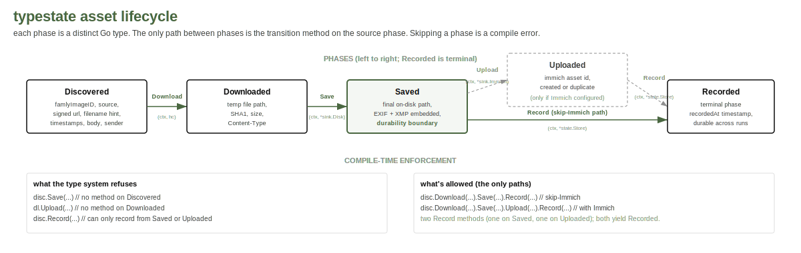

# ADR 0002: typestate for the asset lifecycle

**Status**: accepted, 2026-05-07

## Context

Each asset bairn handles flows through an ordered sequence:



A bug-prone version of this is a single struct with boolean fields
or a `state string` enum. Skipping a step (uploading without saving;
recording without saving) is a runtime error at best, a silent data
loss at worst.

The "bundled enforcement" principle says: couple data with its
verification. The Go expression of that for a state machine is
typestate, where each phase is a distinct type and the only way
between them is the transition function.

`Saved` is the durable artefact: the file is at its final path with
EXIF embedded as one atomic operation. Streaming to a temp file
before save keeps memory pressure off the large-video path.

## Decision

`internal/asset/` defines five distinct types: `Discovered`,
`Downloaded`, `Saved`, `Uploaded`, `Recorded`. Each carries the
data it has at that point. Transitions are functions that take one
and return the next:

```go
func (d Discovered) Download(ctx context.Context, hc *http.Client) (Downloaded, error)
func (dl Downloaded) Save(ctx context.Context, disk *sink.Disk, software string) (Saved, error)
func (s Saved) Upload(ctx context.Context, immich *sink.Immich) (Uploaded, error)
func (s Saved) Record(ctx context.Context, store *state.Store) (Recorded, error)
func (u Uploaded) Record(ctx context.Context, store *state.Store) (Recorded, error)
```

`Recorded` is the terminal phase and is constructable from either
`Saved` (skip-Immich runs) or `Uploaded` (Immich runs). Two distinct
`Record` methods rather than an interface; branching typestate via
two methods costs less than the abstraction it would replace.

EXIF reinjection folds into Save: `sink.Disk.Put` writes the file
and reinjects EXIF as one atomic step. `Saved` therefore implies
"EXIF reinjection attempted"; the state DB records whether it
actually succeeded (`exifError` empty or non-empty).

Memory shape: `Downloaded` carries the path to a temp file plus the
SHA1 of the bytes, never the bytes themselves. `Save` renames the
temp into place via `sink.Disk`.

## Considered

- **Single struct with a `state` enum.** Loses compile-time
  enforcement. Rejected on bundled-enforcement grounds.
- **Interface-of-recordable.** Define an unexported `recordable`
  interface implemented by both `Saved` and `Uploaded`. Cleaner
  but more abstract than two methods. Rejected at this size.
- **In-memory bytes throughout.** Original draft. Rejected: OOM
  risk on large videos, no incremental durability.
- **Sidecar-based EXIF.** Write a `.json` next to the photo and
  let the reader compose. Rejected per the archival posture (ADR
  0005): metadata lives in the file.

## Consequences

- Five small types instead of one, each with a single-purpose
  transition. Readable as a straight pipeline.
- Disk is durable as soon as `Saved`. A crash after `Saved` and
  before `Uploaded` is recoverable on the next run because the
  state file shows `saved_at` set and `uploaded_at` empty.
- EXIF reinjection failures don't corrupt the save. The save
  succeeds; EXIF is best-effort. State records the error.
- Refactors that change the lifecycle (adding a step, splitting
  one) ripple through the type system. That's the feature.

## Revisit when

- The lifecycle gains conditional steps that fork (e.g. "EXIF fix
  for images, atom rewrite for videos"). Branching typestate is
  achievable but adds cost; weigh against an interface there.
