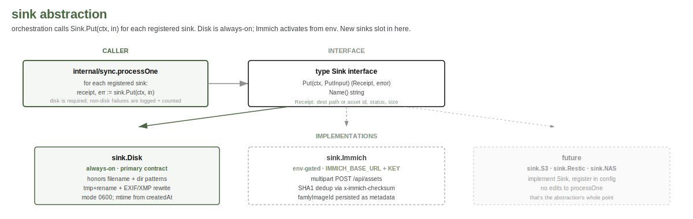

# ADR 0006: sink abstraction (disk + Immich + future)

**Status**: accepted, 2026-05-07

## Context

bairn writes assets to two destinations: a local directory (always
on, the primary contract of an archival tool) and Immich (optional,
configured via env). The original `internal/sync` referenced an
Immich client directly. Adding the disk path inline would have
forked `processOne` for every new destination.

A `Sink` interface with two implementations keeps the orchestration
loop linear and opens the door for further sinks (S3, NAS via
sshfs, restic) without re-touching the loop.

## Decision



`internal/sink/` defines:

```go
// Sketch (simplified). The concrete shapes live in
// internal/sink/sink.go; PutInput in particular has flat fields for
// each piece of bairn-side context (FamlyImageID, Source,
// FeedItemID, FileCreatedAt, EXIF, Body, ...) rather than a nested
// struct.
type Sink interface {
    // Put stores the asset and returns a destination-specific
    // receipt. Successful Put implies the artefact is durable
    // for that sink.
    Put(ctx context.Context, in PutInput) (Receipt, error)

    // Name returns a stable identifier ("disk", "immich") used
    // in logs and state DB column choices.
    Name() string
}

type PutInput struct {
    SourcePath string // path to the source file (temp or saved-on-disk for chained sinks)
    SHA1       string // hex; the sink may use this for dedup
    // bairn-side context: image id, source kind, parent feed item, timestamps, EXIF fields, body
}

type Receipt struct {
    DestPath  string  // disk: final filesystem path; immich: vendor asset id
    Status    string  // "created", "duplicate", "skipped"
    Size      int64
}
```

Two implementations land in this refactor:

- **`sink.Disk`** is the always-on primary. It honours the
  filename and directory pattern from configuration (jacobbunk-style
  strftime + Go template tokens), atomically writes the file via
  tmp+rename, sets filesystem mtime from `Asset.CreatedAt`, and
  returns the final path.
- **`sink.Immich`** wraps `api/immich.Client.Upload` and surfaces
  the duplicate/created status in the receipt.

The orchestration loop in `internal/sync` always calls `sink.Disk`
first (durability), then iterates through any additional sinks the
config has registered. Failure of a non-disk sink does not block
recording; it logs and increments the per-sink retry counter.

`sink.Disk` is wired before `internal/asset.Save` is invoked; the
typestate transition `Downloaded → Saved` calls into Disk under
the hood.

## Considered

- **Inline disk + inline Immich in sync.** Simplest. Forks the
  loop on every new sink. Rejected.
- **Pipeline-of-sinks abstraction (Beam-style).** Powerful, vastly
  over-engineered for two sinks. Rejected.
- **Plugin loading from disk.** A future where third parties ship
  their own sinks without recompile. Rejected: bairn is a personal
  tool; recompile is fine.

## Consequences

- Adding a new destination is "implement Sink, register in config."
  No edits to `processOne`.
- Each sink owns its own retries and idempotency; the orchestration
  loop just sequences them.
- The `Receipt.Status` enum stays small (`created`, `duplicate`,
  `skipped`); state DB stores it under a per-sink namespace.

## Revisit when

- A third sink lands and the registration UX stops feeling clean.
- A sink's failure mode needs richer return information than a
  flat `Receipt`.
